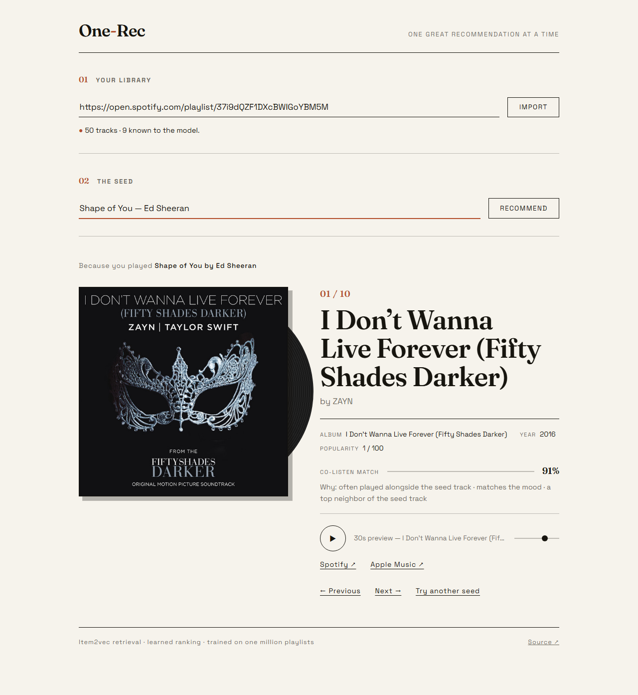
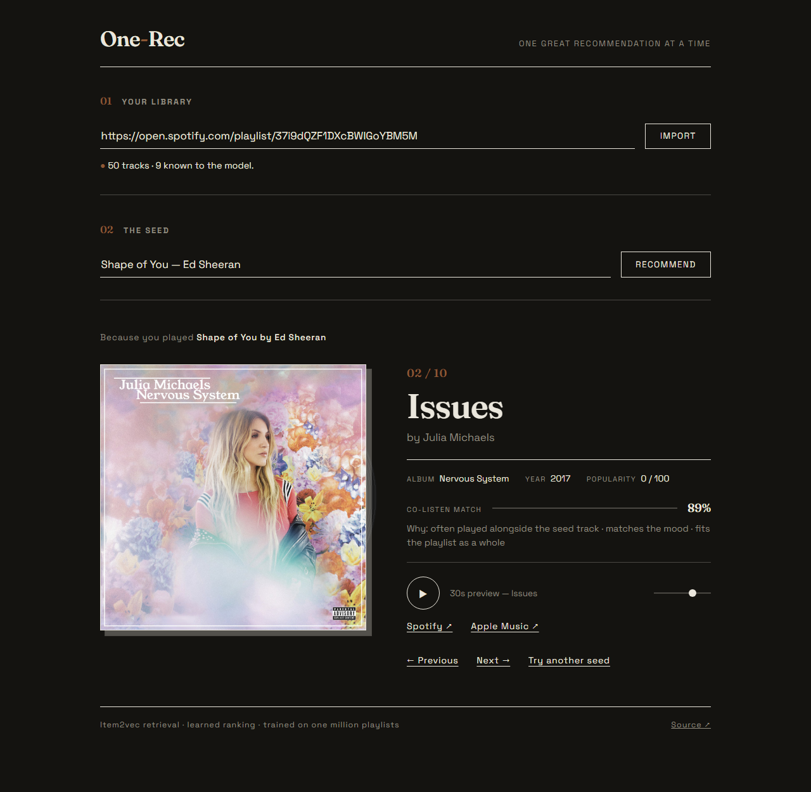
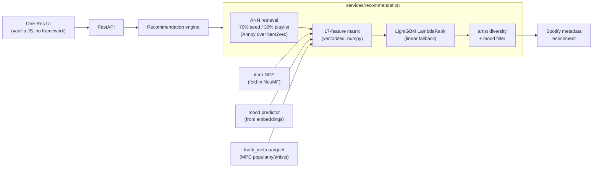

# One-Rec

**Paste a playlist. Search a song. Get one great recommendation at a time.**

A hybrid music recommendation engine serving 597K tracks — item2vec embeddings
trained on the Spotify Million Playlist Dataset, ANN retrieval, and a LightGBM
LambdaRank model over signals that actually exist at serving time.



<details>
<summary>Dark mode</summary>



</details>

## How it works



1. **Retrieval** — the searched song ("seed") drives 70% of the ~1,000-candidate
   pool via its Annoy neighbors; the playlist mean vector supplies the rest.
   Seeds outside the vocabulary fall back to a same-artist proxy track.
2. **Ranking** — every candidate gets a 17-feature vector (seed/playlist
   cosines, ANN reciprocal ranks, item-NCF score, MPD popularity prior, artist
   overlap, mood similarity, duration fit) scored by a LambdaRank model trained
   on leave-N-out playlist continuation with **the exact serving retrieval**.
3. **Diversity** — one track per artist, mood-filtered, then enriched with live
   Spotify metadata (artwork, previews, links).

Every recommendation ships its explanation — the top SHAP-style feature
contributions — and the similarity shown in the UI is the real seed cosine,
hidden when the seed isn't in the model rather than faked.

### Honest-signals design

Spotify deprecated its audio-features and recommendations APIs (403/404 for
new apps), which silently killed most classic feature sets. Everything here is
computable offline at serving time:

| Signal | Source |
|---|---|
| Co-listen similarity | item2vec (200-dim, trained on 1M playlists) |
| **Acoustic similarity** | Discogs-EffNet embeddings of 30s preview clips (46K tracks, PCA-256) — what songs actually *sound* like |
| Collaborative score | item-NCF (fold-in NeuMF, BPR loss) — scores unseen playlists by mean-pooling |
| Mood (valence/energy/…) | regression from item2vec embeddings, trained while the audio API existed |
| Popularity prior, artists, durations | aggregated from the Million Playlist Dataset |

A byte-identical feature spec is shared between serving and the training
notebook, and the model loader refuses any artifact whose feature names don't
match — training/serving drift fails loudly, at startup.

## Offline evaluation

Metrics are **end-to-end and unconditional**: queries whose positives never
survive retrieval count as zero-scoring failures instead of being silently
dropped (the usual way recommender metrics flatter themselves). Held-out
playlists, leave-N-out, seed-graded relevance, candidates from the exact
serving retrieval path — from `models/metrics.json`, reproduced locally by
[`scripts/evaluate.py`](scripts/evaluate.py):

| Ranker | NDCG@10 | Recall@10 | Recall@50 | Hit@1 | MRR |
|---|---|---|---|---|---|
| **LightGBM LambdaRank (seed-graded + audio)** | **0.247** | **0.314** | **0.570** | **0.206** | **0.310** |
| seed-cosine only (previous system) | 0.101 | 0.122 | 0.270 | 0.092 | 0.150 |
| popularity only | 0.084 | 0.121 | 0.365 | 0.054 | 0.125 |
| raw retrieval order | 0.101 | 0.121 | 0.270 | 0.092 | 0.150 |

2.5× the NDCG@10 of the single-signal system it replaced; the single top
recommendation is a held-out playlist track 21% of the time (Hit@1 matters
here — the UI promises *one* great recommendation). Seed-only requests (no
playlist context) are evaluated as their own slice. A stagewise recall funnel
in `metrics.json` attributes every lost positive to retrieval or a specific
filter, and an ablation grid over the irreversible filters keeps those choices
evidence-based. Serving adds tunable dials on top: `SEED_AFFINITY` (pull
results toward the seed's sound) and `DISCOVERY` (dampen the popularity prior
for surprising-but-fitting deep cuts).

## Running it

```bash
pip install -r requirements.txt
python scripts/download_models.py     # ~1.4 GB from the GitHub release
cp .env.example .env                  # add your Spotify client credentials
python run_local.py                   # http://localhost:8000
```

Or with Docker (models stay volume-mounted, never baked into the image):

```bash
docker compose up --build
```

Spotify credentials come from a free [developer app](https://developer.spotify.com/dashboard)
and are only used for search + display metadata.

## Training

The full pipeline — MPD parsing, item-NCF training, ranker dataset
construction, LambdaRank training, evaluation — runs in one Kaggle notebook on
a free GPU session (~3h). See [training/README.md](training/README.md).

## API

| Method | Path | Purpose |
|---|---|---|
| `GET` | `/api/v1/search` | track search (Spotify, Apple fallback) |
| `POST` | `/api/v1/playlist/import` | resolve a public playlist URL to entries |
| `POST` | `/api/v1/playlist/recommendations` | seed-driven recommendations |
| `GET` | `/health` | health check |

## Tests

```bash
pytest -m "not slow"    # fast suite, fake model stack (runs in CI)
pytest -m slow          # loads the real 2.3 GB artifacts, asserts the feature contract
```

## Stack

FastAPI · gensim (item2vec) · Annoy · LightGBM · PyTorch (optional, lazy) ·
pandas/pyarrow · vanilla ES-module frontend with a strict CSP (no frameworks,
no inline scripts, self-hosted fonts).
