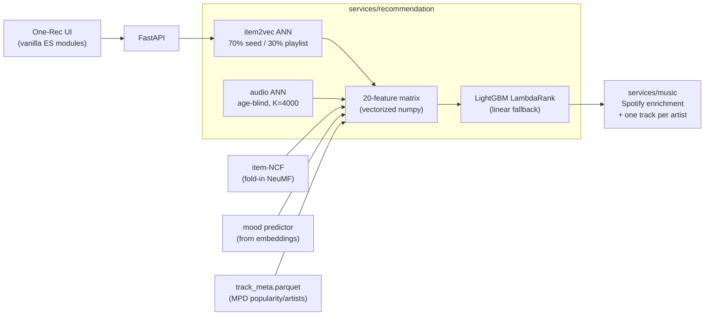

# One-Rec

One-Rec is a hybrid music recommender over 597,682 tracks from the Spotify
Million Playlist Dataset. You search for a track, optionally paste a playlist
for context, and it returns a single song plus the features that put it there.
Retrieval is an Annoy index over item2vec embeddings, and a LightGBM LambdaRank
model does the final ordering.


<details>
<summary>Dark mode</summary>


</details>

The MPD stops in 2017, so the catalog does too. A newer seed has no
co-occurrence vector and resolves through a same-artist proxy, though if it has
a preview clip it still gets its own audio vector (more on that below). There's
no hosted demo either, because the serving artifacts come to ~1.8 GB.

## Quick start

```bash
pip install -r requirements.txt
python scripts/download_models.py     # ~1.8 GB from the GitHub release
cp .env.example .env                  # add your Spotify client credentials
python run_local.py                   # http://localhost:8000
```

Spotify credentials come from a free [developer app](https://developer.spotify.com/dashboard).
Nothing Spotify returns feeds the ranker - it's search and display metadata
only - though tracks Spotify can't identify do get dropped from the final list,
and the service refills from the next-best candidates when that happens.

There's also a compose file, which volume-mounts the models so they stay out of
the image:

```bash
docker compose up --build
```

## How it works



**Retrieval.** Your seed track's nearest neighbours in the Annoy index fill
about 700 of a 1,000-candidate pool and the mean vector of your playlist fills
the rest. With no playlist, the seed takes all 1,000. There's a second channel
on top of that: if the seed has an audio vector, another 4,000 candidates come
from the audio index. That channel is age-blind, which is the point - it reaches
tracks that have no co-occurrence vector at all, so a 2023 release can surface
for a 2015 seed. It has to go 4,000 deep to do it, because in calibration the
tracks a human would actually accept as a swap sat around audio rank 3.5-4K out
of 65K. Ranking 5,000 rows is a few milliseconds, so the depth is free.

One detail that took me a while to notice: the seed gets stripped out of its own
playlist context before any features are computed. Otherwise "fits the playlist"
partly restates "is the seed," and the model learns to trust a feature that is
really just measuring itself.

**Ranking.** Every candidate becomes a 20-feature vector: seed and playlist
cosines, ANN reciprocal ranks, an item-NCF score, a popularity prior, and
thirteen more listed in `features.py`. A LambdaRank model scores them. It was
trained on leave-N-out playlist continuation against the same retrieval code
that runs in production, so the candidates it learned to sort look like the ones
it actually sees.

**Diversity.** The service takes one track per artist after Spotify enrichment.
Both hard filters that used to live in the engine are off now. In the funnel
measurements, capping artists before the ranker cost more candidate recall than
it bought, and so did vetoing on mood, which earns only about 2% of model gain
in the first place. The ranker sees everything and `mood_sim` handles coherence
as a feature.

**Explanations.** Each recommendation carries its top feature contributions,
from LightGBM's `pred_contrib`. The similarity percentage in the UI is the seed
co-listen cosine straight out of the model - the proxy's, when the seed itself
is out of vocabulary - and the field hides itself rather than showing a number
when that cosine is near zero.

When an optional subsystem is missing, its features collapse to a constant
across the whole candidate set: 0 for scores and indicators, 0.5 for mood diffs.
A constant column can't reorder anything within a query, so the app degrades to
a smaller model instead of a wrong one. The startup log prints a capability
table saying which artifacts actually loaded.

### Where the signals come from

Spotify deprecated its audio-features and recommendations endpoints, and new
apps now get a 403 or 404 from both. That removes most of the feature set you'd
find in a recommender tutorial. Everything below is computed offline, so nothing
in the ranking path depends on an endpoint that can vanish.

| Signal | Source |
|---|---|
| Co-listen similarity | item2vec, 200-dim, trained on 1M playlists |
| Acoustic similarity | Discogs-EffNet embeddings of 30s preview clips, PCA-256 |
| Collaborative score | item-NCF (fold-in NeuMF, BPR loss), mean-pools unseen playlists |
| Mood (valence/energy/...) | regression from item2vec embeddings, trained while the audio API still worked |
| Popularity prior, artists, durations | aggregated from the Million Playlist Dataset |

The acoustic feature only covers 46K of the 597K tracks, since it needs a
preview clip that still resolves. Everything else covers the full catalog.

## Benchmarks

The recorded evaluation protocol used held-out playlists with leave-N-out.
Candidates came from the API's retrieval path and were scored through the same
policy. It specified end-to-end, unconditional scoring: queries whose held-out
tracks did not survive retrieval counted as zero rather than being dropped.

**Historical results, not independently reproduced.** The table and paired-bootstrap
result below were transcribed from the v11 training run, whose original
`metrics.json` was not preserved. They remain a record of that run, not an
independently reproduced benchmark.

| System (end-to-end, test) | NDCG@10 | Recall@10 | Recall@50 | Hit@1 | MRR |
|---|---|---|---|---|---|
| v2.0.0 release, with playlist context | 0.156 | 0.110 | 0.209 | 0.229 | 0.332 |
| v2.0.0 release, seed-only | 0.184 | 0.034 | 0.089 | 0.286 | 0.393 |
| previous release, exact-served, with playlist | 0.108 | 0.075 | 0.131 | 0.161 | 0.246 |
| previous release, exact-served, seed-only | 0.154 | 0.029 | 0.069 | 0.217 | 0.327 |

The recorded release gate was a paired-bootstrap difference of +0.039 NDCG@10,
95% CI [+0.036, +0.043]. Its baseline was the previous system rerun through the
historical harness, not its published numbers. The run attributed most of the
gain to a wider candidate funnel.

Hit@1 is the column I care about, since the UI only ever shows one track. In
those recorded results, the single recommendation was a held-out playlist track
23-29% of the time. Seed-only requests were their own slice with their own funnel.

[`evaluation/metrics_summary.json`](evaluation/metrics_summary.json) retains the
transcribed figures and the SHA-256 hashes of the v2.0.0 ranker and policy. The
hashes identify those artifacts; they do not verify the scores or confidence
interval.

[`scripts/evaluate.py`](scripts/evaluate.py) runs local comparisons on an exported
held-out candidate sample using the installed ranker and policy. It skips groups
with no positive labels and does not simulate Spotify-availability losses or the
final one-track-per-artist rule. Its results are therefore conditional on the
surviving sample, not the unconditional end-to-end results in the historical
table. It also does not compute the paired-bootstrap result above. New results
depend on the evaluation sample and model/policy artifacts supplied.

The [training notebook](training/kaggle_train_ranker.ipynb) tracks original
positive counts and dropped queries for end-to-end scoring. It can support new
measurements, but it does not recover the missing historical run output.

The historical run froze the serving policy on validation. I swept the
`SEED_AFFINITY` and `DISCOVERY` dials under two constraints: seed similarity at
parity with the previous system, popularity below its served level. The recorded
winning setting cost about a point of raw NDCG@10, 0.168 down to 0.156, which I
took because the results stayed closer to the seed's sound and leaned toward
tracks you probably haven't heard.

The historical ablations also reported a disappointment: the audio and mood
features were ranking-neutral on that test set. You can hear what they do; NDCG
couldn't see it in that run.

## Contracts

The feature spec exists twice, once in the serving path and once in the training
notebook, and a test fails if the two copies differ by a byte. The ranker loader
compares `model.feature_name()` against that spec and refuses to load on a
mismatch. I'd rather a stale 17-name model fail at startup than drift quietly
into a metrics dashboard.

| Path | What's there |
|---|---|
| `services/recommendation/engine.py` | the whole serving pipeline, retrieval through explanations |
| `services/recommendation/features.py` | `FEATURE_NAMES`, the contract shared with training |
| `services/recommendation/factory.py` | artifact loading and the capability table |
| `services/music/service.py` | playlist resolution, Spotify enrichment, artist dedup |
| `training/kaggle_train_ranker.ipynb` | the training pipeline |

## Training

The whole pipeline runs in one Kaggle notebook on a free GPU session, roughly
three hours: MPD parsing, item-NCF training, ranker dataset construction,
LambdaRank training, evaluation. See [training/README.md](training/README.md).

## API

| Method | Path | Purpose |
|---|---|---|
| `GET` | `/api/v1/search` | track search (Spotify, Apple fallback) |
| `POST` | `/api/v1/playlist/import` | resolve a public playlist URL to entries |
| `POST` | `/api/v1/playlist/recommendations` | seed-driven recommendations |
| `GET` | `/health` | health check |

## Tests

```bash
pytest -m "not slow"    # fast suite, fake model stack (runs in CI)
pytest -m slow          # loads the real ~1.8 GB artifacts, asserts the feature contract
```

## Stack

FastAPI, gensim, Annoy, LightGBM, PyTorch, pandas/pyarrow, scikit-learn. Torch
is imported lazily and the app runs without it, but it's in `requirements.txt`
either way. The frontend is plain ES modules under a strict CSP, with
self-hosted fonts and no framework.

The numpy<2 pin is load-bearing for the gensim and annoy ABIs. If you bump it,
things break in ways that don't look like a numpy problem.

## Data and license

The code here is MIT licensed. The training data isn't mine to license: it's the
[Spotify Million Playlist Dataset](https://www.aicrowd.com/challenges/spotify-million-playlist-dataset-challenge),
released for non-commercial, open research use, and both the dataset and the
artifacts derived from it stay subject to Spotify's terms. The model release
includes MPD-derived metadata, so treat the whole serving set as research use
only and not as something to build a product on. To retrain from scratch you'll
need to accept those terms and pull the MPD yourself.
